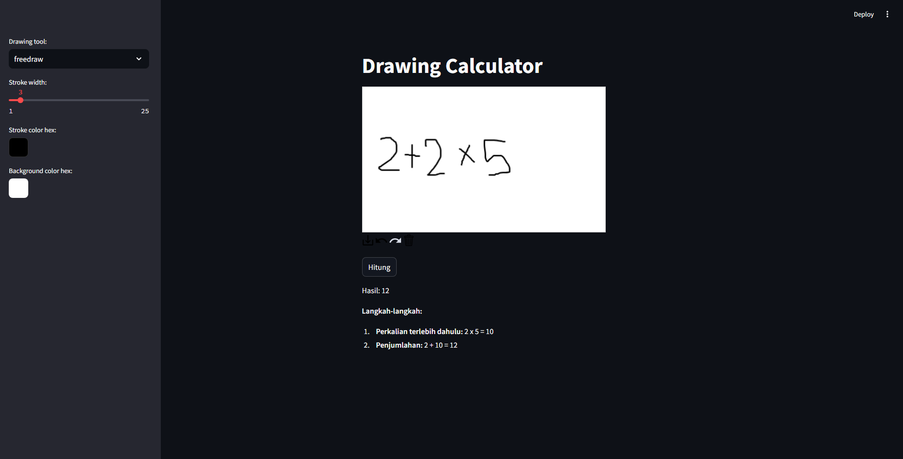

# Drawing Calculator with Gemini

This project is a **Drawing Calculator** that allows users to solve mathematical problems by drawing or writing numbers and equations. The application uses **Gemini** as the underlying AI model to interpret and solve the problems. The interface is built with **Streamlit**, providing a user-friendly canvas for interaction.

## Project Overview

The key components of this project include:
1. **Gemini AI Model**: The core engine that interprets user inputs (drawings or text) and calculates the results.
2. **Streamlit Interface**: A simple and intuitive web interface for user interaction.
3. **Drawing Canvas**: A feature that lets users draw or write mathematical expressions directly in the browser.
4. **Problem Solving**: The system processes user input, understands it, and provides the calculated result.

## Technologies Used
1. **Python**: For backend logic and integration with the Gemini model.
2. **Streamlit**: For building the web-based user interface.
3. **Gemini**: For interpreting and solving mathematical expressions drawn or written by users.

## Features
- **Interactive Canvas**: A drawing area where users can sketch mathematical expressions.
- **AI Calculation**: Gemini interprets and calculates results from the input provided on the canvas.
- **Real-Time Feedback**: Users receive instant answers to their mathematical problems.

## Future Improvements
- Add **OCR (Optical Character Recognition)** to improve the system's ability to recognize handwritten text more accurately.
- Add support for more complex equations and symbols.
- Provide step-by-step solutions for educational purposes.
